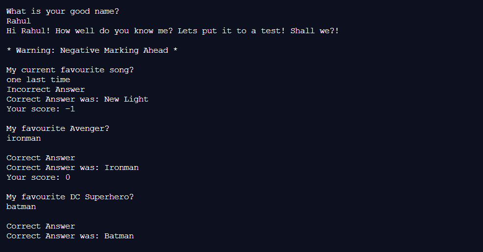

# MyQuizCLI

Built a <b>CLI Quiz Game</b> on myself.
 
Take the quiz to find out how well you know me.
 
A part of submission of an assignment for <b>neogcamp.</b>
 

### View Live Demo
<pre><a href="https://repl.it/@satvikchachra/endGame?embed=1&output=1"><b>repl.it/@satvikchachra/endGame</b></a></pre>

### Features

* User Answers are evaluated.
* User Score is kept.

### How the game works?

The game is simple! 
 
If you answer <b>correctly</b> you will be awarded <b>+1 Point</b>,
 
but if you answer <b>incorrectly</b> you will be awarded <b>-1 Point</b>

### Image

  
Landing Page

    

Let's find out how well you know me.
 
This illustrates the use of NodeJS.
 

Have fun playing.

##### Built with ♥ by <a href="https://github.com/satvikchachra">satvikchachra</a>

